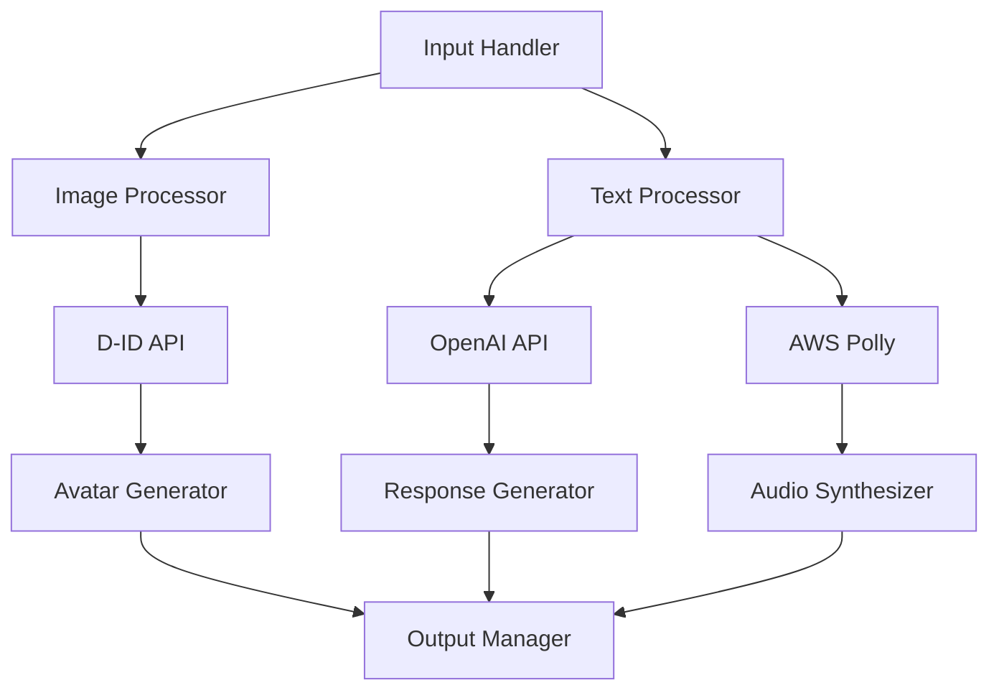

# AI Avatar System Implementation Guide

## Document Control
- **Version:** 1.0.0
- **Last Updated:** 2024-02-01
- **Author:** Maria-Teresa Carmier

## Table of Contents
1. [System Overview](#system-overview)
2. [Technical Requirements](#technical-requirements)
3. [System Architecture](#system-architecture)
4. [Implementation Guide](#implementation-guide)
5. [Performance Optimization](#performance-optimization)
6. [Security Considerations](#security-considerations)
7. [Troubleshooting](#troubleshooting)
8. [Version History](#version-history)

## System Overview

### Purpose
This documentation outlines the technical implementation of an AI-powered avatar system designed for educational environments. The system enables real-time generation and interaction with historical figure avatars through multiple AI service integrations.

### Core Features
- Real-time avatar generation from historical images
- Natural language processing for interactive dialogue
- Text-to-speech synthesis for dynamic responses
- Multi-platform compatibility
- Scalable architecture for classroom deployment

## Technical Requirements

### System Requirements
- Server: Node.js v14+ or Python 3.8+
- Memory: 4GB RAM minimum
- Storage: 1GB minimum
- Network: 10 Mbps dedicated bandwidth
- Database: PostgreSQL 12+ or MongoDB 4.4+

### API Dependencies
```json
{
  "required_apis": {
    "d_id": "^2.0.0",
    "openai": "^1.0.0",
    "aws_polly": "^2.1156.0",
    "midjourney": "latest"
  }
}
```

### Browser Compatibility
- Chrome (v88+)
- Firefox (v85+)
- Safari (v14+)
- Edge (v88+)

## System Architecture

### Component Integration


### Data Flow

#### Input Processing
- Image validation and optimization
- Text normalization
- Query preprocessing

#### API Integration
- Parallel API calls
- Response aggregation
- Error handling

#### Output Generation
- Avatar rendering
- Audio synthesis
- Response formatting

## Implementation Guide

### Initial Setup
```python
def initialize_system():
    # Load environment variables
    load_dotenv()
    
    # Configure API clients
    d_id_client = configure_d_id()
    openai_client = configure_openai()
    polly_client = configure_aws_polly()
    
    # Initialize database connection
    db = initialize_database()
    
    return {
        'd_id': d_id_client,
        'openai': openai_client,
        'polly': polly_client,
        'db': db
    }
```

### Avatar Generation Process
```python
async def generate_avatar(image_data, text_input):
    try:
        # Process image
        processed_image = await process_image(image_data)
        
        # Generate avatar
        avatar = await d_id_client.create_avatar(processed_image)
        
        # Generate speech
        speech = await polly_client.synthesize_speech(text_input)
        
        # Combine outputs
        final_output = await combine_avatar_and_speech(avatar, speech)
        
        return final_output
        
    except ApiError as e:
        log_error(e)
        raise SystemError("Avatar generation failed")
```

## Performance Optimization

### Caching Strategy
- Implement Redis for session caching
- Store frequently accessed avatars
- Cache API responses for 1 hour

### Resource Management
```python
RESOURCE_LIMITS = {
    'max_concurrent_users': 30,
    'max_avatar_size': '10MB',
    'max_audio_length': '30s',
    'request_timeout': '5s'
}
```

## Security Considerations

### API Security
- Implement rate limiting
- Use API key rotation
- Enable request logging
- Implement JWT authentication

### Data Protection
```python
def secure_data_handling():
    # Encrypt sensitive data
    encryption = initialize_encryption()
    
    # Set up secure sessions
    session_manager = configure_sessions()
    
    # Configure CORS
    cors = setup_cors_policies()
    
    return {
        'encryption': encryption,
        'sessions': session_manager,
        'cors': cors
    }
```

## Troubleshooting

### Common Issues

#### Avatar Generation Failures
- Check image format compatibility
- Verify API key validity
- Monitor rate limits

#### Audio Synthesis Errors
- Validate text input length
- Check AWS credentials
- Verify audio format support

### Error Logging
```python
def log_error(error, context):
    logger.error({
        'timestamp': datetime.now(),
        'error_type': type(error).__name__,
        'message': str(error),
        'context': context,
        'stack_trace': traceback.format_exc()
    })
```

## Version History

### v1.0.0 (2024-02-01)
- Initial release
- Core avatar generation functionality
- Basic API integrations
- Performance monitoring

### Planned Updates
- Enhanced error handling
- Additional API integrations
- Performance optimizations
- Extended browser support
